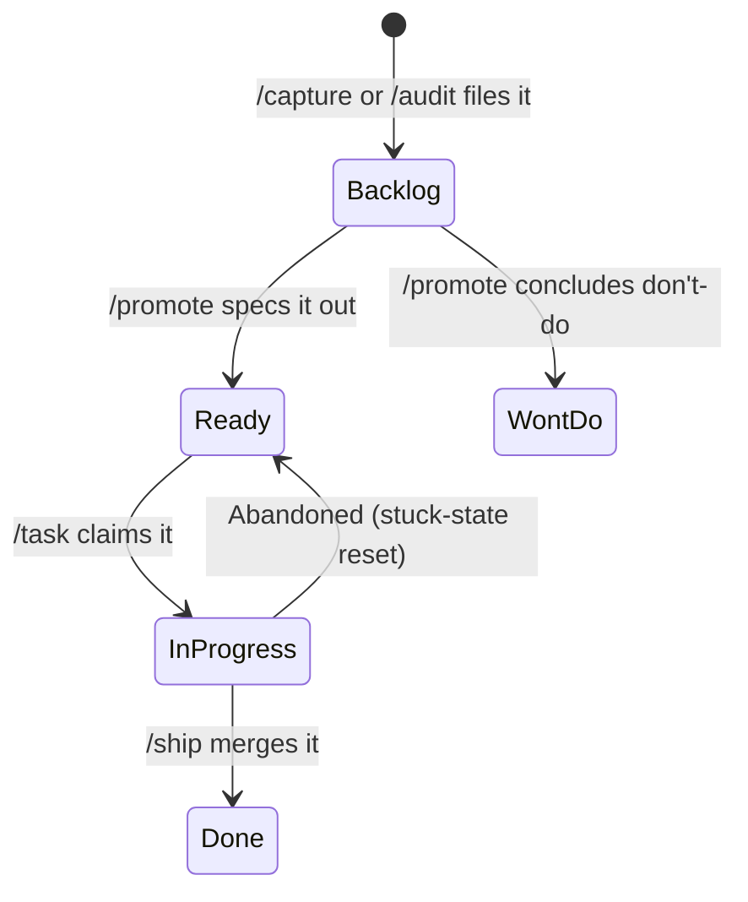
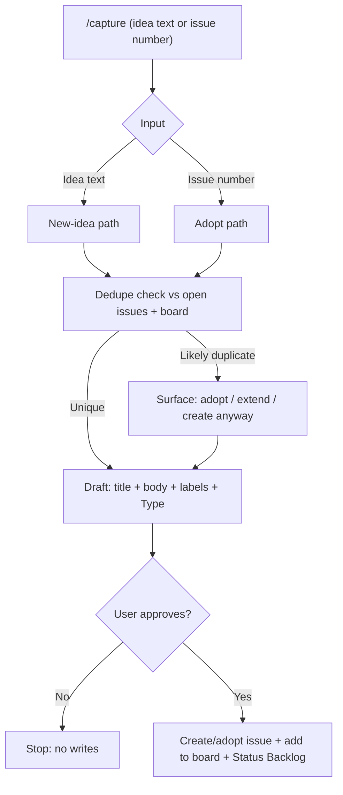
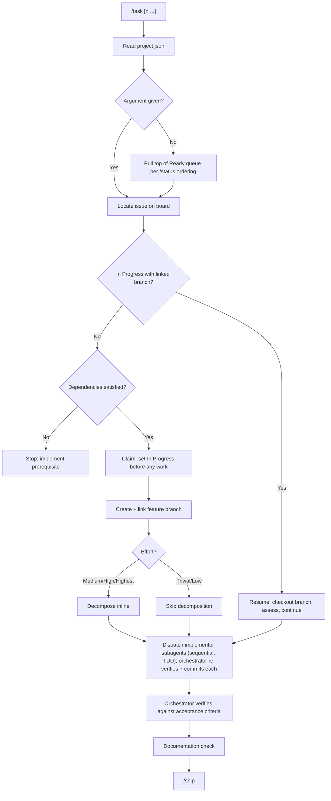
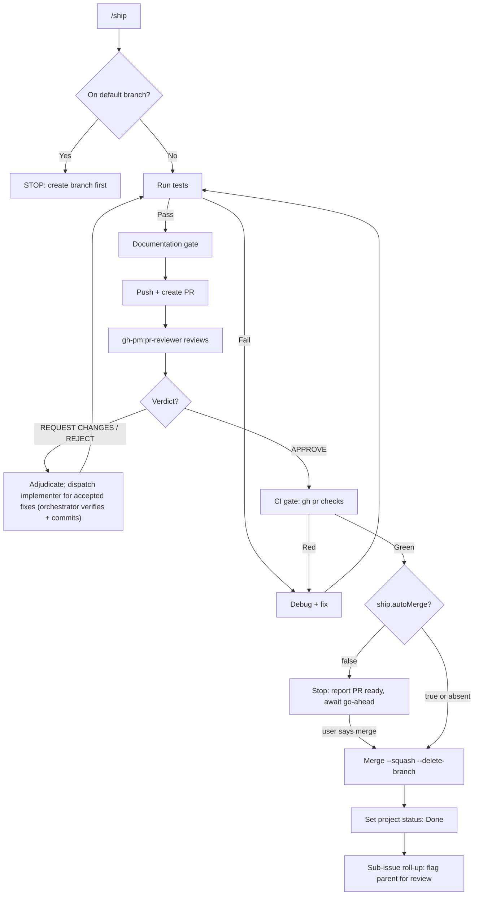
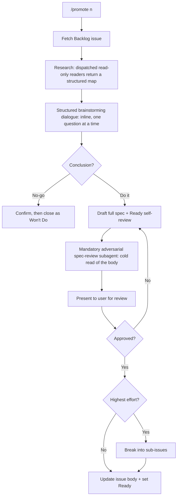
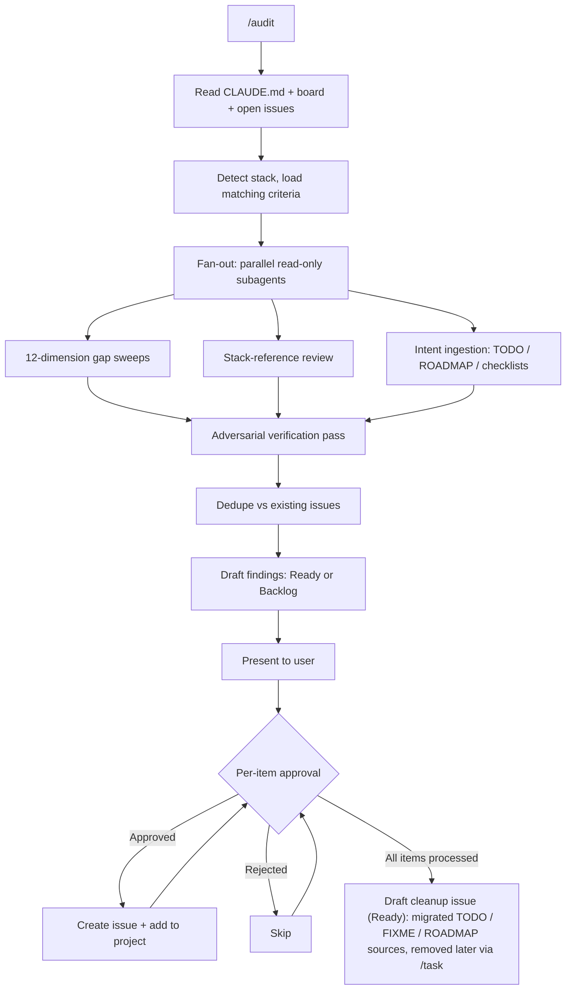
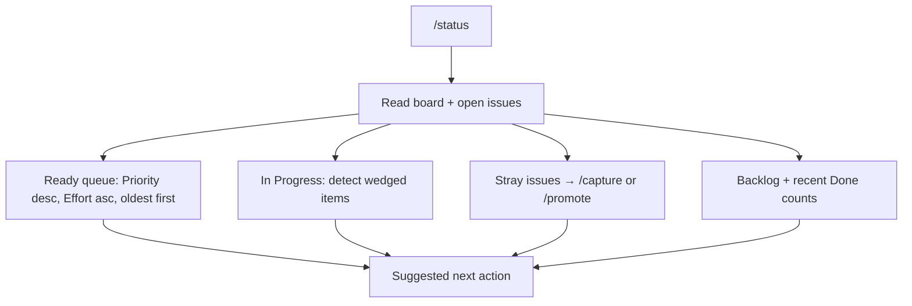
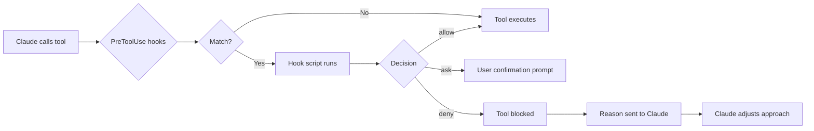

# gh-pm

Claude Code plugin providing project management workflows, enforcement hooks, and a PR reviewer agent. Installed as a marketplace plugin — applies to all repos where enabled.

## Install

```bash
claude plugin install gh-pm@trackness
```

This installs the plugin from the `trackness` marketplace (`trackness/claude-code-marketplace`).

## What's Included

### Agent

| Agent | Purpose |
|-------|---------|
| `pr-reviewer` | Comprehensive PR review covering architecture, security, performance, error handling, testing, and readability |

### Skills

| Skill | Purpose |
|-------|---------|
| `/setup-project` | Bootstrap or adopt a repo: GitHub Project, labels, `.claude/project.json`, and starter CLAUDE.md |
| `/capture` | Point intake: turn a raw idea (or an existing issue) into a Backlog item after a dedupe check |
| `/promote <n>` | Promote a Backlog issue to Ready with a full spec: dispatched read-only research, inline brainstorming, and a mandatory adversarial spec-review before the draft; can exit to Won't Do |
| `/task [n ...]` | Implement a Ready issue end-to-end: claim, branch, decompose, then dispatch implementer subagents while the orchestrator verifies and owns all commits and board writes; verify, ship. No argument pulls the top of the Ready queue; an already-In-Progress issue with a linked branch is resumed, not re-branched |
| `/ship` | Commit, PR, `gh-pm:pr-reviewer` review, CI gate, then merge or hand off per `ship.autoMerge` |
| `/status` | Read-only board observability: the ordered Ready queue, wedged In-Progress work, stray issues, counts, and the next action |
| `/audit` | 12-dimension codebase gap analysis plus TODO/ROADMAP intent ingestion; drafts GitHub Issues for per-item approval |

All skills except `/setup-project` require `.claude/project.json` to exist (created by `/setup-project`).

### Hooks

Enforcement hooks that intercept tool calls at the point of action. They are guardrails, not guarantees: they catch the common mechanical mistakes, they do not claim to close every possible path around them.

| Hook | Intercepts | Matcher |
|------|-----------|---------|
| `no-commit-main.sh` | `git commit` on the default branch (allows `--amend`; `-C`/`--git-dir`/`--work-tree` prompt) | Bash |
| `no-hook-bypass.sh` | `--no-verify` and its abbreviations (`--no-veri`, bundled `-an`/`-na`) on any git command | Bash |
| `enforce-pr-reviewer.sh` | PR review agents that aren't `gh-pm:pr-reviewer` | Agent |
| `enforce-merge-gate.sh` | `gh pr merge` when `ship.autoMerge` is `false` — prompts for confirmation | Bash |

One further hook is a discovery aid, not a guardrail — it runs at session start and never blocks a tool call:

| Hook | Fires at | Behavior |
|------|----------|----------|
| `setup-nudge.sh` | Session start (`startup`/`resume`/`clear`) | In a repo that has a GitHub remote but is not fully configured for gh-pm, injects one line of context offering `/setup-project`. Two triggers: no `.claude/project.json` (bootstrap), or a `project.json` predating the current config schema (non-destructive migration). Stays silent when the repo is configured, when there is no GitHub remote, or when a `.claude/gh-pm-optout` sentinel exists (durable opt-out). |

## Project Configuration

Skills read project-specific IDs from `.claude/project.json` in each repo. This file is created by `/setup-project` and contains:

- GitHub owner, repo name, repository node ID
- GitHub Project number, node ID, all field and option IDs
- Test command (auto-detected)
- Label list

## Dependencies

The plugin itself needs only two system tools — no Claude Code plugin dependencies:
- `gh` — GitHub CLI (used by every skill for GitHub operations)
- `jq` — JSON processing (used by every hook)

The implementation methodology the skills once pulled from an external Claude Code plugin (TDD, verification, debugging, decomposition, review-response, brainstorming) is now vendored inline — see `shared/references/` and each SKILL.md — so no other plugin needs to be enabled alongside gh-pm.

`/setup-project` additionally probes for optional consumer-repo tooling and notes whatever is present — never a hard requirement, never a reason to stop:
- `task` — go-task runner (its presence hints at a `Taskfile.yml` test task during test-command detection)
- `lefthook` — pre-commit hook manager

## Structure

```
gh-pm/
│
├── .claude-plugin/
│   └── plugin.json                      # Plugin manifest (name, version)
│
├── agents/
│   └── pr-reviewer.md                   # PR review agent prompt
│
├── hooks/
│   ├── hooks.json                       # Hook configuration (matchers + script paths)
│   ├── no-commit-main.sh                # Block commits to the default branch (allow amend)
│   ├── no-hook-bypass.sh                # Block --no-verify (and abbreviations)
│   ├── enforce-pr-reviewer.sh           # Block non-gh-pm PR reviewers
│   ├── enforce-merge-gate.sh            # Ask before merge when ship.autoMerge is false
│   └── setup-nudge.sh                   # Session-start onboarding nudge (offer /setup-project; opt-out)
│
├── shared/                              # Shared across every skill and the agent
│   ├── references/
│   │   ├── tdd.md                       # Vendored TDD methodology
│   │   ├── verification.md              # Vendored verification gate
│   │   ├── debugging.md                 # Vendored root-cause debugging
│   │   └── stacks/                      # Stack-specific review criteria
│   │       ├── lang-typescript.md       # JavaScript / TypeScript / React / Node.js
│   │       ├── lang-go.md
│   │       ├── lang-rust.md
│   │       ├── lang-python.md
│   │       ├── infra-docker.md
│   │       └── infra-database.md
│   ├── templates/
│   │   └── issue-body.md                # Single source for the issue body format
│   └── queries/
│       ├── add-blocked-by.graphql        # Dependency mutation (audit + promote)
│       └── combined-issue-query.graphql  # Issue deps, siblings, linked branches (task + ship)
│
└── skills/
    ├── setup-project/
    │   ├── SKILL.md                     # Bootstrap or adopt a repo
    │   ├── queries/
    │   │   ├── update-status-field.graphql
    │   │   ├── create-priority-field.graphql
    │   │   ├── create-effort-field.graphql
    │   │   ├── create-type-field.graphql
    │   │   └── link-project-to-repo.graphql
    │   └── templates/
    │       ├── CLAUDE.md                # Starter CLAUDE.md for new repos
    │       └── project.json             # .claude/project.json schema (incl. ship.autoMerge)
    │
    ├── capture/
    │   └── SKILL.md                     # Point intake: idea or existing issue → Backlog
    │
    ├── promote/
    │   ├── SKILL.md                     # Promote Backlog to Ready (research + spec)
    │   └── queries/
    │       └── add-sub-issue.graphql
    │
    ├── task/
    │   ├── SKILL.md                     # Implement a Ready issue end-to-end
    │   └── queries/
    │       └── create-linked-branch.graphql
    │
    ├── ship/
    │   └── SKILL.md                     # Commit, PR, review, CI gate, merge
    │
    ├── status/
    │   └── SKILL.md                     # Read-only board observability
    │
    └── audit/
        └── SKILL.md                     # 12-dimension gap analysis + intent ingestion
```

## Workflows

### Issue Lifecycle



### /capture Flow



### /task Flow



### /ship Flow

APPROVE means no findings above NITPICK remain; any NITPICK notes are surfaced in the PR summary rather than blocking the merge. A clean review is a precondition for merge, not permission — the CI gate and the `ship.autoMerge` decision still stand between it and `gh pr merge`.



### /promote Flow



### /audit Flow



### /status Flow

Read-only: `/status` reports the board and points at the acting skill for anything that needs a change; it writes nothing itself.



### Hook Enforcement



## Versioning

Current version: **4.0.0**. This line dropped the external plugin dependency (vendoring its methodology into `shared/references/`) and removed three enforcement hooks — both breaking, hence the major bump.

Bump the version in `.claude-plugin/plugin.json` before pushing changes. Also update the version in `trackness/claude-code-marketplace` marketplace.json to match — the two must stay in lockstep or consumers install a stale release. Consumers pick up updates via `claude plugin update gh-pm@trackness`.
